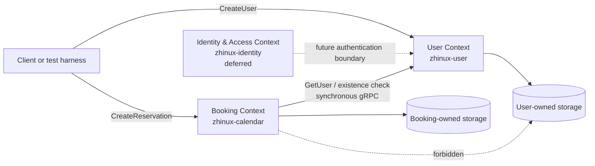

# Zhinux Bounded Contexts

- Status: Active
- Last reviewed: 2026-08-03
- Scope: Lab 4 two-service thin slice and its intended evolution

## Purpose

This document defines ownership, language, and integration rules between the User and Booking bounded contexts. Its primary goal is to let either service change internally without forcing coordinated changes to another service.

## Lab 4 Simplification

The Lab 4 specification names two contexts:

- `identity` for users and tenants.
- `booking` for reservations and conflicts.

Zhinux's intended long-term architecture is more precise:

- `zhinux-user` owns user registry and profile concerns.
- `zhinux-identity` owns authentication and access concerns.
- `zhinux-calendar` owns booking and reservation concerns.

To preserve Lab 4's two-service scope, its simplified `identity` role maps to `zhinux-user`. The Lab 4 runtime is therefore:

- User context: `zhinux-user`.
- Booking context: `zhinux-calendar`.

`zhinux-identity` is explicitly out of scope for this lab. It should not be added merely to satisfy the word “identity” in the lab brief. Authentication, passwords, sessions, tokens, and authorization are separate future capabilities.

## Context Map



## Context Ownership

### User Context

Repository: `zhinux-user`

Owns:

- User identity within the product's user registry.
- User lifecycle and existence.
- Profile attributes such as phone, name, username, and email.
- Uniqueness rules for user-owned identifiers.
- User persistence schema.
- Public User gRPC behavior.

Does not own:

- Password verification, login sessions, or token issuance.
- Reservation eligibility rules beyond exposing authoritative user state.
- Venues, schedules, or reservation conflicts.

### Booking Context

Repository: `zhinux-calendar`

Owns:

- Reservations.
- Venue identifiers as understood by Booking.
- Time ranges and slot invariants.
- Conflict detection.
- Reservation idempotency behavior.
- Booking persistence schema.
- Public Booking gRPC behavior.

Does not own:

- User profiles or credentials.
- Authentication or token issuance.
- User persistence.
- The meaning of User fields beyond the minimum Booking eligibility contract.

### Identity & Access Context

Repository: `zhinux-identity`

Long-term ownership:

- Credentials and authentication.
- Login and logout.
- Access and refresh tokens.
- Account authentication state and security policy.

Lab 4 status: deferred and not part of the create-user → create-reservation flow.

## Ubiquitous Language

| Term | Owning context | Meaning |
| --- | --- | --- |
| User | User | A registered product user with a stable `UserID` |
| UserID | User; referenced by Booking | An opaque identifier issued by User |
| Reservation | Booking | A request accepted for one user, venue, and slot |
| VenueID | Booking | The Booking identifier of a reservable venue |
| Slot | Booking | A venue-specific half-open time interval |
| Conflict | Booking | An overlap violating Booking rules |
| Identity | Identity & Access | Authentication and credential state, not a profile synonym |
| Principal | Identity & Access | An authenticated actor represented by credentials |

Booking may reference a `UserID`, but that does not transfer ownership of the User concept to Booking.

## Integration Contract

### Lab 4 Synchronous Flow

1. A client calls User to create a user.
2. User validates its invariants and stores the user.
3. A client calls Booking to create a reservation with that `UserID`.
4. Booking calls User through a generated gRPC client to verify existence.
5. Booking loads existing reservations from its own repository.
6. Booking applies reservation and conflict rules.
7. Booking stores the accepted reservation in its own repository.

The decision and trade-offs are recorded in `docs/adr/0001-booking-user-validation.md`.

### Contract Ownership

Cross-service API and event schemas live in `zhinux-contracts`.

Rules:

- Services import generated contract packages, never another service's internal packages.
- Proto messages are transport contracts, not shared domain models.
- Each gRPC adapter maps proto messages to local application or domain types.
- Breaking contract changes require a new version.
- Events are deferred for the Lab 4 mandatory path.

## Allowed Dependencies

Booking may depend on:

- Generated `user.v1` contract code.
- A local `UserExistenceChecker` or equivalent outbound port.
- A gRPC adapter implementing that port.
- Shared technical utilities from `zhinux-platform` when they do not contain business concepts.

User may depend on:

- Generated `user.v1` contract code.
- Its own local domain, application, ports, and adapters.
- Shared technical utilities from `zhinux-platform`.

## Forbidden Dependencies

The following are architectural violations:

- Booking reading or writing User tables.
- User reading or writing Booking tables.
- Importing `zhinux-user/internal/...` from Booking.
- Importing `zhinux-calendar/internal/...` from User.
- Sharing ORM entities or persistence models.
- Placing User and Reservation aggregates in a shared library.
- Using `zhinux-contracts` as a home for business logic.
- Adding `zhinux-identity` to the Lab 4 request path without a distinct authentication requirement.

## Consistency Model

Lab 4 uses synchronous validation:

- User existence is strongly checked at reservation request time.
- Booking fails closed when User cannot be reached.
- Booking owns the final conflict and acceptance decision.
- Booking stores only the opaque `UserID`; it does not cache the User profile.

Later event-driven projections will be eventually consistent and require explicit policies for lag, replay, deletion, and suspension.

## Code-Level Enforcement

Each service should maintain:

- A domain package with no gRPC, database, or message-broker imports.
- An application service that depends on local ports.
- A gRPC adapter responsible for proto mapping.
- A repository adapter owned by that service.
- Tests that use fakes at port boundaries.

Recommended Booking port:

```go
type UserExistenceChecker interface {
    Exists(ctx context.Context, userID string) (bool, error)
}
```

The exact name may change, but the dependency direction must remain Booking application → Booking-owned port ← User gRPC adapter.

## Lab 4 Proof Checklist

- [ ] User and Booking run as separate processes.
- [ ] Create user → create reservation succeeds.
- [ ] An unknown user cannot create a reservation.
- [ ] Booking never accesses User storage.
- [ ] Neither service imports the other's internal packages.
- [ ] Unit tests prove domain and application behavior.
- [ ] An integration test proves the gRPC boundary.
- [ ] Service boundary docs remain synchronized with this document.

## Future Evolution

Labs 5–7 may add:

- `UserCreated` and user lifecycle events.
- A Booking-owned user eligibility projection.
- NATS and JetStream delivery.
- Retry, dead-letter, outbox, and idempotent-consumer behavior.

Those capabilities should extend this boundary rather than weakening service ownership.
